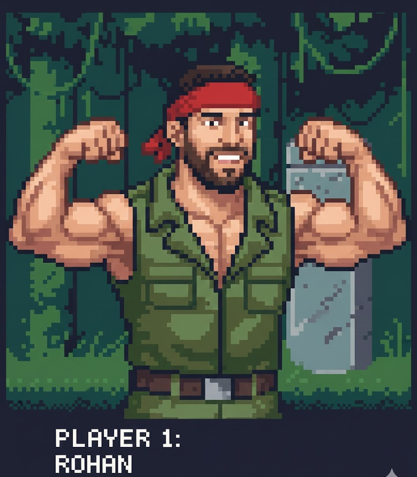

::: {.grid}

::: {.g-col-12 .g-col-md-4}
{.rounded}

### Contact
 [Email](mailto:rohnshinge@gmail.com)
:::

::: {.g-col-12 .g-col-md-8}
I am an analytics professional with a passion for building end-to-end data solutions that bridge complex backend engineering with high-level strategic insights. My expertise lies in architecting robust measurement frameworks, automating reporting workflows and driving data integrity to support executive decision-making. 

I am driven by complex problem-solving - whether it is debugging a critical datasource error, projecting revenue impacts through sandbox analysis or mentoring peers on SQL and dashboarding best practices.
:::

:::

---

## Professional Experience

{width=80px}
**Marketing Analyst, Ads Marketing Analytics** | *August 2022 - Present*

* Led the conception, coding, and production launch of **Shadowfax**, an automated email system delivering weekly event performance reports to 600+ PMMs.
* Spearheaded the end-to-end development of a **Company-Level Dashboard**, managing stakeholders, backend infrastructure, and legal review.
* Built comprehensive reporting infrastructure and interactive dashboards to empower senior leadership with insights into global event performance.
* Reduced data processing time by **80%** by creating efficient data pipelines with custom macros for event impact metrics.
* Created a program-level dashboard to evaluate program spend and attendance, facilitating performance benchmarking across programs.
* Identified and recommended solutions to fix segmentation issues, improving accuracy by **25%**.

:::

---

{width=50px}
**Sr. Analyst, Interconnected Merchandising Insights** | *Sept 2019 - Aug 2022*

* Implemented **Causal Impact algorithms** (Python, R) to identify top subscription items, contributing to **40% YoY growth**.
* Created a Tableau dashboard for the Online Pricing team, saving **55 hours of effort per event**.
* Mentored an intern in developing diagnostic reports for negative margin items with actionable solutions.
* Launched an innovative **Newness report** to track new assortment sales across categories.
* Conducted SQL training sessions for the Assortment Growth team to improve production-level code quality.

:::

---

### Institute of Transportation Studies (ITS)
**Data Analyst** | *September 2018 - July 2019*

* Segmented customers by membership type to identify usage trends using SQL and Tableau.
* Performed congestion analysis to identify high-potential stations based on demand and utilization.

---

{width=80px}
**Application Development Analyst** | *August 2016 - March 2018*

*Developed and maintained enterprise-level applications.*
:::

---

## Education

{width=80px} ### University of California, Davis
::: {layout="[10, 90]"}

**Master of Science, Business Analytics** | *Sept 2018 - July 2019*
* Awarded the GSM Alumni Association Student Fellowship Award for outstanding leadership.
* President, Dean’s Student Advisory Council (DSAC).

:::

### University of Mumbai
::: {layout="[10, 90]"}
{width=80px}

**Bachelor of Engineering, Electronics** | *June 2012 - May 2016*
* Built a prototype eye-controlled wheelchair on Python using a Raspberry Pi microprocessor and a USB camera.
* President, Student’s Council.

:::
