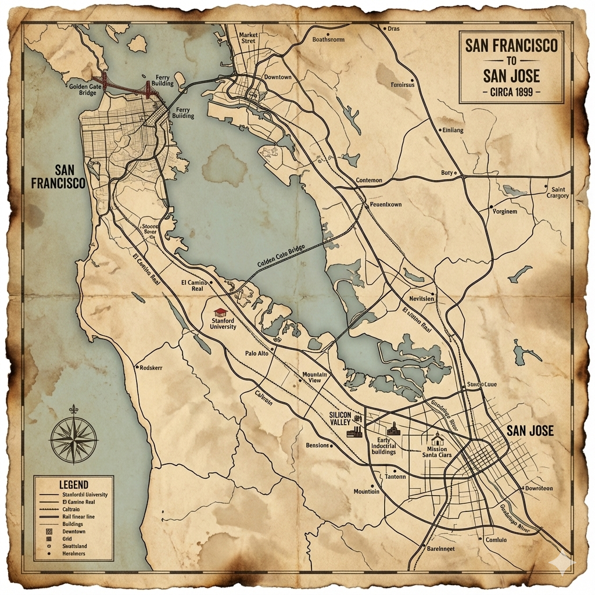

```{=html}
<link href="[https://fonts.googleapis.com/css2?family=Press+Start+2P&display=swap](https://fonts.googleapis.com/css2?family=Press+Start+2P&display=swap)" rel="stylesheet">

<div class="typing-container">
  <div class="static-text">Is life</div>
  <div class="typewriter-wrapper">
    <span class="typewriter"></span>
  </div>
</div>

<style>
  .typing-container {
    display: flex;
    flex-direction: column; 
    justify-content: center;
    align-items: center; 
    background-color: transparent; 
    padding: 20px 0;
    font-family: 'Press Start 2P', cursive;
    text-align: center;
  }

  .static-text {
    font-size: 20px;
    color: #fff;
    margin-bottom: 15px;
    white-space: nowrap;
  }

  .typewriter-wrapper {
    display: flex;
    justify-content: center;
    height: 28px;
    width: 100%;
  }

  .typewriter {
    font-size: 20px;
    color: #ff7f50;
    display: inline-block;
    position: relative;
    overflow: hidden; 
    white-space: nowrap;
    border-right: 4px solid #ff7f50; 
    width: 0;
    animation: 
      typing-width 18s steps(35) infinite, 
      cursor 0.8s infinite;
  }

  .typewriter::before {
    content: "";
    animation: words-content 18s infinite;
  }

  @keyframes cursor {
    0%, 100% { border-color: #ff7f50; }
    50% { border-color: transparent; }
  }

  @keyframes typing-width {
    0%, 5%, 20% { width: 0; }
    10%, 15% { width: 18ch; }
    21%, 25%, 40% { width: 0; }
    30%, 35% { width: 28ch; }
    41%, 45%, 60% { width: 0; }
    50%, 55% { width: 9ch; }
    61%, 65%, 80% { width: 0; }
    70%, 75% { width: 12ch; }
    81%, 85%, 100% { width: 0; }
    90%, 95% { width: 13ch; }
  }

  @keyframes words-content {
    0%, 20% { content: "a virtual reality?"; }
    21%, 40% { content: "an online multiplayer game?"; }
    41%, 60% { content: "all maya?"; }
    61%, 80% { content: "an illusion?"; }
    81%, 100% { content: "a simulation?"; }
  }
</style>
